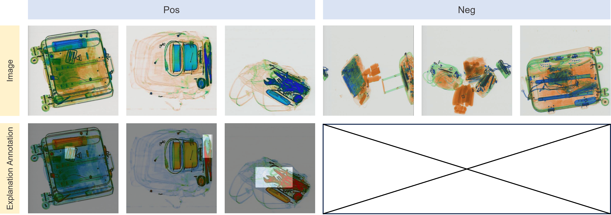
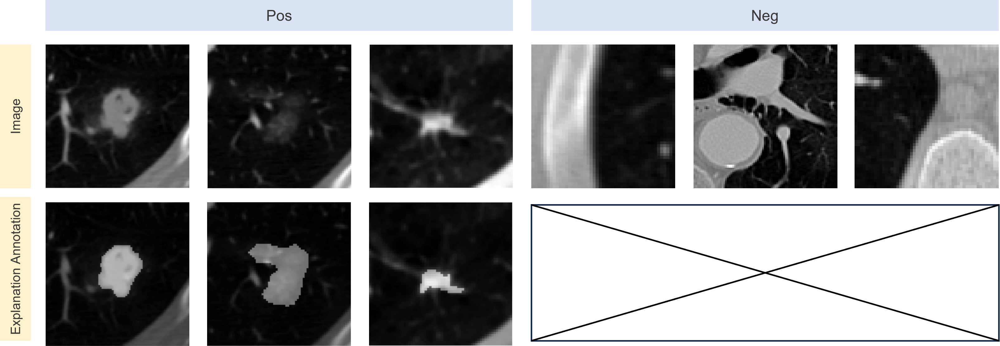
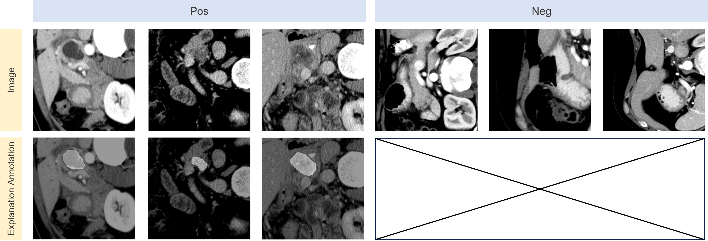

## Overview of datasets

| Dataset                           | Class Type  |   Size    |     Annotation Type     |    Format    | Balanced | Counterfactual |
|:----------------------------------|:-----------:|:---------:|:-----------------------:|:------------:|:--------:|:--------------:|
| [Gender  Classification](#gender-classification)        |   Binary    |   1,736   |    Human annotation     |  Pixel-wise  |   Yes    |      Yes       |
| [Scene  Recognition](#scene-recognition)            |   Binary    |   2,086   |    Human annotation     |  Pixel-wise  |   Yes    |      Yes       |
| [Face Glasses  Recognition](#face-glasses-recognition)     |   Binary    |    885    |    Human annotation     |  Pixel-wise  |   Yes    |       No       |
| [Prohibited  Item Detection](#prohibited-item-detection)    |   Binary    | 1,059,231 |    Human annotation     | Bounding-box |    No    |       No       |
| [Nodule  Detection](#nodule-detection)             |   Binary    |   2,625   |    Human annotation     |  Pixel-wise  |    No    |       No       |
| [Tumor  Detection](#tumor-detection)              |   Binary    |    281    |    Human annotation     |  Pixel-wise  |    No    |       No       |
| [Cats and Dogs  Classification](#cats-and-dogs-classification) | Multi-class |   7,349   | Foreground segmentation |  Pixel-wise  |   Yes    |       No       |
| [Object  Classification](#object-classification)        | Multi-class |  11,540   | Foreground segmentation |  Pixel-wise  |   Yes    |       No       |

## Gender Classification

| [Download](https://drive.google.com/uc?export=download&id=1JLlgy3MwrWOZXVHXRItrefoNP4uuVuWc) | 

The gender classification task utilized in our study is derived from the [Microsoft COCO](https://cocodataset.org/) dataset. 
To construct the task-specific dataset, 
we extracted images from the COCO dataset that contained captions with the terms "men" or "women". 
Further filtering was performed to remove images that had both genders mentioned in the caption, 
multiple individuals present, or depicted as unrecognizable humans. 
Additionally, a subset of the images underwent manual annotation by human annotators, 
resulting in factual and counterfactual masks. 
The dataset comprises a total of 1,736 images, evenly distributed between female and male annotations.

## Scene Recognition

| [Download](https://drive.google.com/uc?export=download&id=1LM7RlgxmKavq6eaVfRaJDmmipvpzq9c-) |

The scene recognition dataset used in our study is derived from the [Places365](http://places2.csail.mit.edu/index.html) dataset. 
The dataset was further annotated manually by [Gao et al.](https://arxiv.org/pdf/2206.13413.pdf) to obtain factual and counterfactual masks. 
The task of this dataset involves binary classification for scene recognition, 
specifically distinguishing between nature and urban scenes. 
To create the dataset, specific categories were selected for sampling, including nature categories. 
Specifically, the categories used to sample the data are:
_Nature_: mountain, pond, waterfall, field wild, forest broadleaf, rainforest
_Urban_: house, bridge, campus, tower, street, driveway
In total, the dataset comprises 2,086 images, each annotated with human explanation labels.

## Face Glasses Recognition

| [Download](https://drive.google.com/uc?export=download&id=1cuRej_M_8z-3MxEeUWoTFLaJsodRdu84) |

The glasses recognition dataset utilized in our study is derived from the [CelebAMask-HQ](http://mmlab.ie.cuhk.edu.hk/projects/CelebA/CelebAMask_HQ.html) dataset. 
The dataset is initially categorized by distinguishing face images with and without glasses. 
The CelebAMask-HQ dataset includes manually annotated masks with 19 classes covering various facial components and accessories. 
Using the segmentation of eyes and glasses, we derive factual labels for recognizing glasses. 
The dataset includes 885 images, each with corresponding explanation annotations.

## Prohibited Item Detection

| [Download](https://drive.google.com/uc?export=download&id=1wYpdD-CLHShfwDENhhqfbO4P--g5y5-o) |

The prohibited item detection task in our study is constructed using the [Sixray](https://github.com/MeioJane/SIXray) dataset. 
The dataset is partitioned by categorizing images based on the presence of prohibited items. 
The Sixray dataset encompasses a vast collection of 1,059,231 X-ray images, 
accompanied by image-level explanation annotations provided by human security inspectors. 
These annotations cover six classes, encompassing a total of 8,929 prohibited items. 
For the purpose of our task, the six prohibited classes are merged, 
resulting in a binary prohibited item detection problem. 
All images in the dataset include bounding box annotations for the prohibited items.

## Nodule Detection

| [Download](https://drive.google.com/uc?export=download&id=1tb531H4UHQhB3v4h-4CIDcH_7sUwf6b4) |

We construct the nodule detection dataset from [LIDC-IDRI](https://pubmed.ncbi.nlm.nih.gov/21452728/) 
which consists of lung cancer screening thoracic computed tomography (CT) scans with marked-up annotated lesions. 
We preprocess the 3D nodule images into 2D images by taking the middle slice along the z-axis and keeping the dimension as 224 x 224. 
Annotations are from at most four experienced thoracic radiologists in XML format. 
We obtain ground truth explanation by computing the consensus volume amongst the provided four annotations corresponding to each image at a 50% consensus level. 
After locating the nodules, we further slice surrounding areas as our negative samples. 
The dataset after preprocessing includes a total of 2625 nodules and 65505 non-nodules images. 
We use this dataset for the nodule detection task, where the objective is to determine whether an image includes a nodule or not.

## Tumor Detection

| [Download](https://drive.google.com/uc?export=download&id=1yxfnD63jz5pksQwKkR7dAqAu35G6EvCm) |

To construct our dataset, we sourced normal pancreas images from the [Cancer Imaging Archive](https://wiki.cancerimagingarchive.net/display/Public/Pancreas-CT). 
Abnormal images, on the other hand, were obtained from the Medical Segmentation Decathlon dataset (MSD). 
The dataset comprises a total of 281 scans with tumors and 80 scans without tumors. 
To preprocess the data, we transformed it into 2D images by randomly selecting a slice along the z-axis. 
Within the MSD dataset, two types of annotations are available: tumor lesions and pancreas segmentation. 
In our study, we considered the tumor lesions as our explanation labels.

## Cats and Dogs Classification

| [Download](https://drive.google.com/uc?export=download&id=1O5monh6f5fwjcaz6AvDWabq6eNmiCA_B) |

The Cats and Dogs Classification Dataset used in our study is constructed from The [Oxford-IIIT Pet](https://www.robots.ox.ac.uk/~vgg/data/pets/) Dataset. 
This dataset is specifically curated for pet image analysis tasks. 
It consists of over 7,000 images distributed across 37 different categories, all of which are breeds of dogs or cats. 
Each image in the dataset is annotated with ground truth pixel-level trimap segmentation. 
The Oxford-IIIT Pet Dataset serves as a valuable resource for training and evaluating computer vision models 
in the domain of pet image analysis. 
In our study, the explanation annotations were generated by extracting pixel-level foreground segmentation corresponding to the image label class.

## Object Classification

| [Download](https://drive.google.com/uc?export=download&id=1khAmuKY_wjMBkQBn_rECeH-Mry4oWxJt) |

The Object Classification Dataset utilized in our study is constructed from the [PASCAL VOC 2012](http://host.robots.ox.ac.uk/pascal/VOC/voc2012/) Dataset. 
The PASCAL VOC 2012 Dataset is an extensive collection of images that covers 20 diverse object categories. 
These include _cars, dogs, chairs, people, bicycles, cats, horses, birds, boats, aeroplanes, buses, trains, motorcycles, cows, dining tables, potted plants, sheep, sofas, TVs, and bottles_. 
Each image within the dataset is manually annotated with object bounding boxes, pixel-level segmentation masks, 
and corresponding class labels for the identified objects. 
The VOC 2012 Dataset comprises approximately 11,540 images, providing a diverse and extensive resource for object classification research. 
In our study, the explanation annotations were generated by extracting pixel-level foreground segmentation corresponding to the image label class. 
